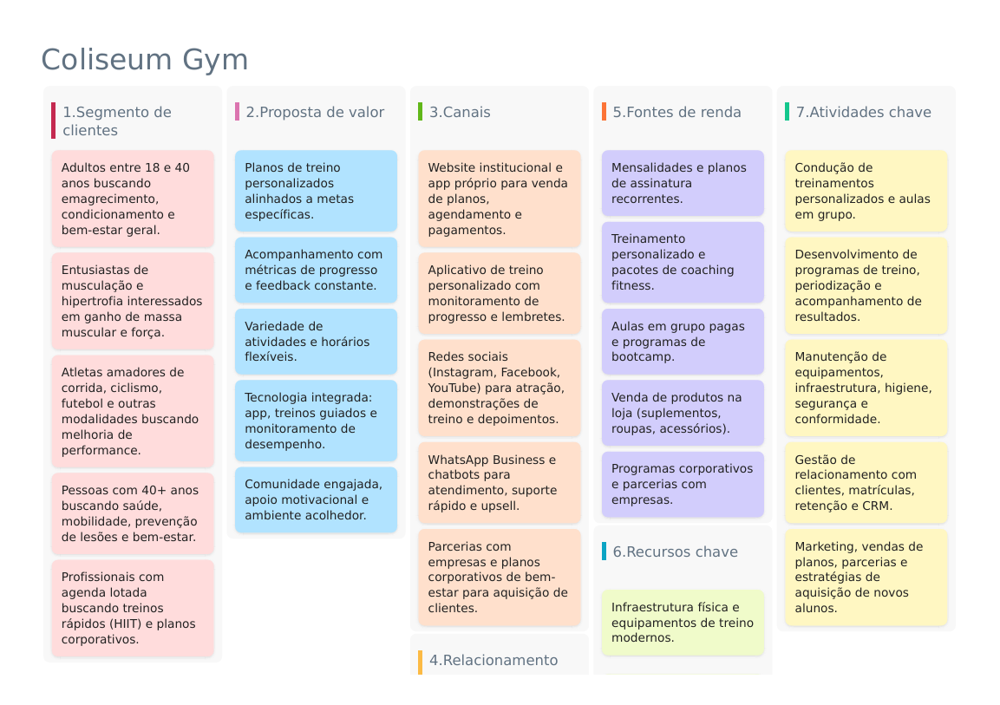
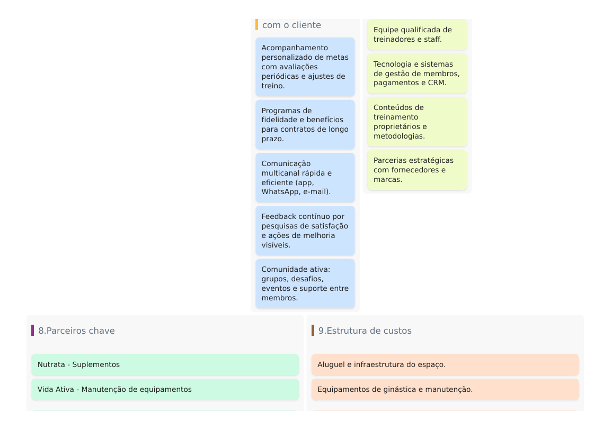
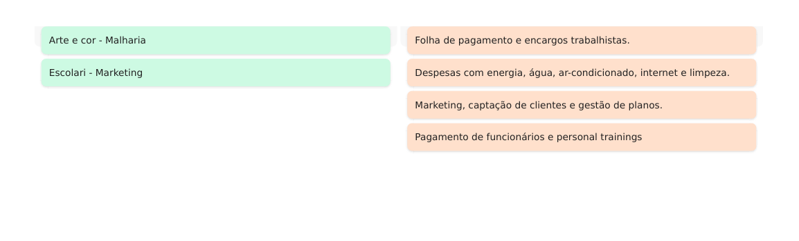

# 2. Descrição do Projeto

## 2.1 Visão Geral

O Sistema **Coliseum Gym** é uma plataforma de software desenvolvida com o objetivo de auxiliar a gestão administrativa e operacional de academias, centralizando informações e automatizando processos essenciais do dia a dia.

O sistema foi concebido para atender às necessidades de diferentes perfis de usuários, como alunos, instrutores e administradores, promovendo maior organização, controle e eficiência nos processos internos da academia. A proposta principal é reduzir tarefas manuais, minimizar erros operacionais e fornecer informações confiáveis para apoio à tomada de decisão.

Entre os principais problemas que o sistema busca solucionar, destacam-se:
- Dificuldade no controle manual de alunos e planos;
- Falta de acompanhamento estruturado dos treinos;
- Gestão ineficiente de pagamentos e inadimplência;
- Ausência de controle automatizado de entrada e saída;
- Dificuldade na geração de relatórios administrativos e financeiros.

O sistema permitirá, de forma integrada:

- Gerenciamento completo de alunos (cadastro, atualização, status ativo/inativo);
- Controle de planos e pagamentos, com registro de mensalidades;
- Registro, edição e acompanhamento de treinos personalizados;
- Sistema de reserva e cancelamento de aulas coletivas, com controle de vagas;
- Registro de entrada e saída de alunos;
- Geração de relatórios administrativos e financeiros para apoio gerencial.

O Coliseum Gym foi projetado considerando princípios de organização, usabilidade e escalabilidade, permitindo futuras evoluções do sistema conforme o crescimento da academia.

---

## 2.1.1 Canvas do Projeto

O Canvas do Projeto foi utilizado como ferramenta visual para auxiliar na compreensão do modelo de negócio, dos usuários envolvidos, das funcionalidades principais e da proposta de valor do sistema.

Por meio do canvas, foi possível identificar:
- O público-alvo do sistema;
- Os principais problemas enfrentados pela academia;
- As soluções propostas pelo sistema;
- Os recursos necessários para desenvolvimento;
- As atividades-chave do projeto.

A seguir, apresentam-se os canvases desenvolvidos para o sistema Coliseum Gym:

---

## 2.2 Stakeholders

Os stakeholders representam as partes interessadas que interagem direta ou indiretamente com o sistema. A correta identificação desses atores é fundamental para garantir que o sistema atenda às necessidades reais do contexto onde será utilizado.

| Stakeholder | Descrição |
|------------|-----------|
| **Aluno** | Usuário final do sistema. Utiliza a plataforma para consultar treinos, reservar aulas coletivas, acompanhar pagamentos e visualizar seu status na academia. |
| **Instrutor** | Responsável por registrar, atualizar e acompanhar os treinos dos alunos, além de auxiliar na condução das aulas coletivas. |
| **Administrador** | Gerencia os dados do sistema, incluindo cadastro de alunos, instrutores, planos, pagamentos, aulas coletivas e geração de relatórios. |
| **Sistema/Porteiro** | Responsável pelo controle de entrada e saída dos alunos, validando o status financeiro e de matrícula. |
| **Direção da Academia** | Utiliza relatórios administrativos e financeiros gerados pelo sistema para apoio à tomada de decisões estratégicas. |

---
